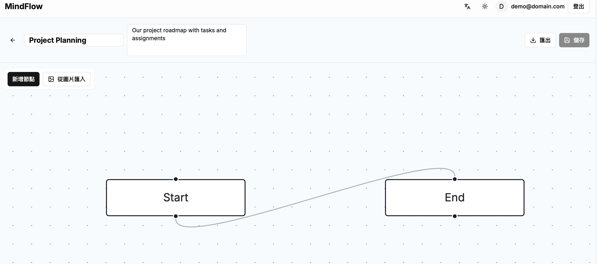
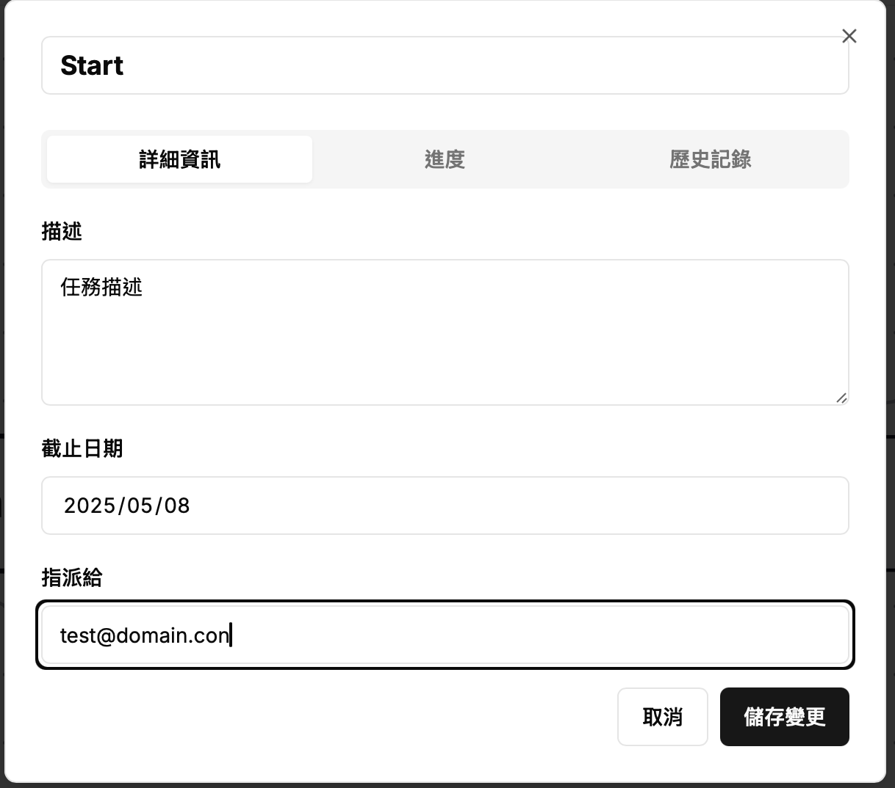
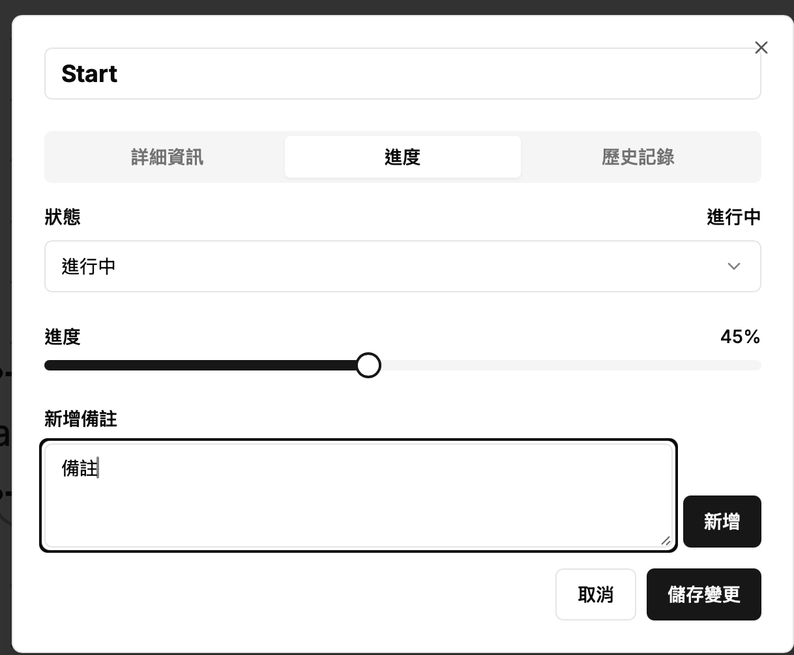
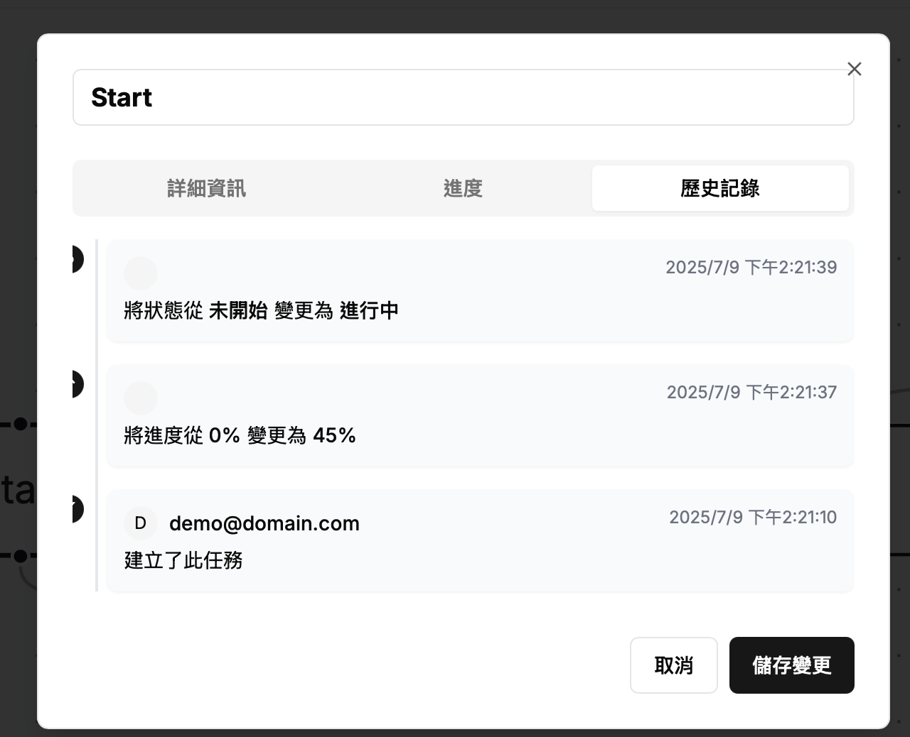
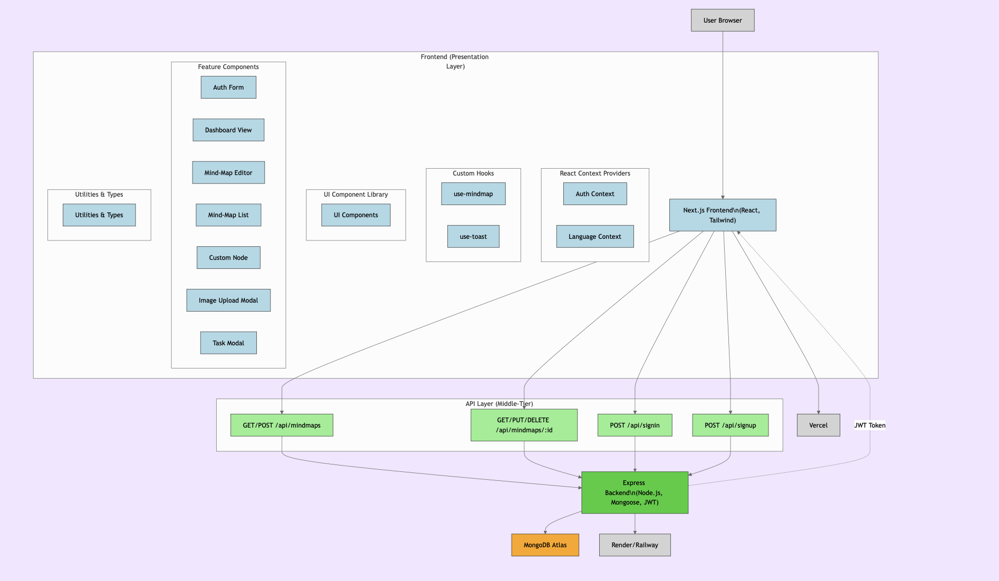

# Mindflow 

Mindflow 是一個結合心智圖與專案管理，讓使用者能以視覺化方式規劃專案架構，同時具備協作與進度追蹤功能。

專案以 Next.js 為前端 + Node.js（Express）為後端 + MongoDB 為資料庫後端 (Mongoose 連接)






## 專案結構

```
.
├── frontend/   # Next.js 
└── backend/    # Express 
```



## 環境設定
請分別在 `frontend/.env` 和 `backend/.env` 中設定必要的環境變數，並記得將其加入 `.gitignore`。

### MongoDB 資料庫設定

本專案使用 MongoDB Atlas 作為雲端資料庫，並透過 Mongoose 套件進行連接與操作。

- 使用 [MongoDB Atlas](https://www.mongodb.com/cloud/atlas) 建立免費 cluster
- 前往「Database Access」新增使用者帳密
- 在「Network Access」中開啟 0.0.0.0/0 以允許 Railway/Vercel 等雲端平台存取
- 獲取連線資訊並填入後端 `.env` 中的 `MONGO_URI` 欄位

### frontend/.env.local 範例
```env
API_BASE = 後端URL（例如 http://localhost:4000）
```

### backend/.env 範例
```env
PORT=4000
MONGO_URI=MongoDB Atlas URI（例如 mongodb+srv://...）
JWT_SECRET=JWT 加密密鑰
```

## 啟動
### 安裝依賴

```bash
cd frontend
npm install

cd ../backend
npm install
```

### 本地啟動

- 前端：
  ```bash
  cd frontend
  npm run dev
  ```

- 後端：
  ```bash
  cd backend
  node server.js
  ```

## 注意事項

- 請勿將 `node_modules/`、`.env`、`.next/` 等目錄加入版本控制

